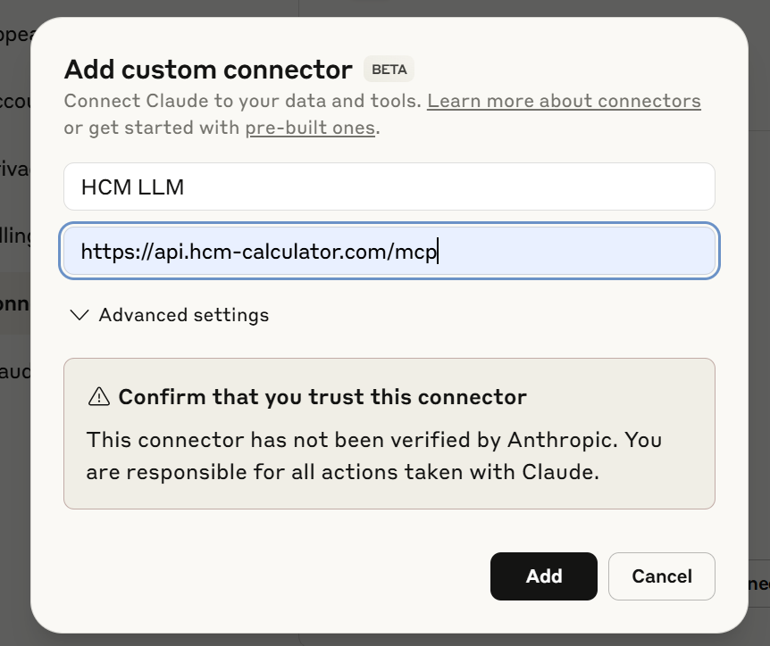

<h1 align="center">HCM-LLM MCP Server</h1>

A FastAPI-based Model Context Protocol (MCP) server for Highway Capacity Manual (HCM) analysis and transportation engineering calculations. So far, this server provides comprehensive two-lane highway analysis following HCM Chapter 15 methodology.

## Features

- Semantic search over HCM documentation
- Complete HCM Chapter 15 two-lane highway analysis
- YAML-based function registry for easy extensibility
- Function calling interface with 15+ transportation analysis functions
- MCP server compatibility for integration with AI assistants (supporting Claude)
- RESTful API endpoints for direct access
- Dynamic endpoint generation based on registry
- Comprehensive test suite and validation tools

## Connect to Remote MCP Server
This server can be used as a backend for AI code agents like Claude Desktop, allowing them to perform complex transportation analyses and access HCM documentation dynamically.

To enable this functionality, add the server to your AI assistant's configuration as an MCP server.

### For Claude Desktop Users
From user setting, you can find `Connectors` tab and click `Add custom connector`.

Then add `https://api.hcm-calculator.com/mcp` to you Claude configuration.



### For GitHub Copilot on VSCode Users
You can also use this server with GitHub Copilot by configuring it as a custom MCP server.

To do this, type Ctrl+p and select `MCP: Open User Configuration` and modify the following to your `mcp.json`:

```json
{
	"servers": {
		"hcm-mcp": {
			"url": "https://api.hcm-calculator.com/mcp"
		}
	}
}
```

## Connect to Local MCP Server
You can also run this server locally for development or testing purposes.

```bash
uv venv

# Windows
.venv\Scripts\activate
# Linux
source .venv/bin/activate

uv pip install .
```

Then running the server.

```bash
# Setup the database.
python hcm_mcp_server/scripts/import_hcm_docs.py

# Start the server.
python mcp_server_fastapi.py
```

### For Claude Desktop Users
Open Claude Desktop and add the server as a custom MCP server with the URL `http://localhost:8000/mcp`.

Add to your Claude Desktop configuration (`claude_desktop_config.json`):

**Note**: Seems like this json settings are not working these days (https://github.com/anthropics/claude-code/issues/4188), and it did not work in my desktop environment, either.

```bash
{
  "mcpServers": {
    "hcm-mcp-local": {
      "url": "http://127.0.0.1:8000/mcp"
    }
  }
}
```

### For GitHub Copilot on VSCode Users
Same thing as above, you can use this server with GitHub Copilot by configuring it as a custom MCP server.

To do this, type Ctrl+p and select `MCP: Open User Configuration` and modify the following to your `mcp.json`:

```json
{
	"servers": {
		"hcm-mcp-local": {
			"url": "http://127.0.0.1:8000/mcp"
		}
	}
}
```

Then you can use the function calling interface directly in your code editor.


## Project Structure

```
hcm-mcp-server/
├── mcp_server_fastapi.py        # Main FastAPI application
├── functions_registry.yaml      # Function registry configuration
├── hcm_mcp_server/
│   ├── example_prompts/                  
│   │   ├── *.txt                # Example prompts for function calling
│   │   └── *.json               # Example json files for web validation
│   ├── core/                    # Core application modules
│   │   ├── dependencies.py      # Dependency injection and utilities
│   │   ├── registry.py          # Function registry implementation
│   │   ├── models.py            # Pydantic data models
│   │   └── endpoints.py         # Dynamic endpoint creation
│   ├── functions/                  
│   │   ├── chapter15.py         # Chapter 15: Two-Lane Highways
│   │   └── research.py          # Research and documentation
│   └── scripts/                    
│       ├── import_hcm_docs.py   # Import HCM documentation and setup ChromaDB
│       └── validate_registry.py # Registry validation
├── data/                           
│   └──  hcm_files/               # HCM documentation files
└── chroma_db/                    # ChromaDB storage

```

## Configuration

### Environment Variables
Create a `.env` file based on `.env.example`. Copy and paste the following content, or `cp .env.example .env`:
```
CHROMA_DB_PATH=./chroma_db
HOST=127.0.0.1
PORT=8000
ALLOWED_ORIGINS=http://localhost:3000,http://localhost:3001
LOG_LEVEL=INFO
DB_MODE=local
PUBLIC_SUPABASE_URL=https://
PUBLIC_SUPABASE_API=your-anon-key / service-role-key
```

### Function Registry
Functions are defined in `functions_registry.yaml`:

```yaml
functions:
  chapter15:
    identify_vertical_class:
      module: "functions.chapter15"
      function: "identify_vertical_class_function"
      description: "Identify vertical alignment class range"
      category: "transportation"
      chapter: 15
      step: 1
      parameters:
        type: "object"
        properties:
          segment_index:
            type: "integer"
          highway_data:
            type: "object"
        required: ["segment_index", "highway_data"]
```

## API Usage

### Complete Highway Analysis

```bash
curl -X POST "http://localhost:8000/analysis/chapter15/complete" \
  -H "Content-Type: application/json" \
  -d '{
    "segments": [{
      "passing_type": 0,
      "length": 2.0,
      "grade": 2.0,
      "spl": 50.0,
      "volume": 760.0,
      "volume_op": 1500.0,
      "phf": 0.95,
      "phv": 5.0
    }],
    "lane_width": 12.0,
    "shoulder_width": 6.0,
    "apd": 5.0
  }'
```

### Function Calling Interface

```bash
curl -X POST "http://localhost:8000/tools/call" \
  -H "Content-Type: application/json" \
  -d '{
    "function": {
      "name": "chapter15_determine_free_flow_speed",
      "arguments": {
        "segment_index": 0,
        "highway_data": {
          "segments": [{"passing_type": 0, "length": 2.0, "grade": 2.0, "spl": 50.0}],
          "lane_width": 12.0,
          "shoulder_width": 6.0
        }
      }
    }
  }'
```

### List Available Functions

```bash
# List all functions
curl -X POST "http://localhost:8000/tools/list"

# Filter by category
curl -X POST "http://localhost:8000/tools/list" \
  -H "Content-Type: application/json" \
  -d '{"category": "transportation"}'

# Filter by chapter
curl -X POST "http://localhost:8000/tools/list" \
  -H "Content-Type: application/json" \
  -d '{"chapter": 15}'
```

### Query HCM Documentation

```bash
curl -X POST "http://localhost:8000/tools/query-hcm" \
  -H "Content-Type: application/json" \
  -d '{
    "question": "What factors affect free flow speed in two-lane highways?",
    "top_k": 5
  }'
```

## Available Functions

### Chapter 15 Functions
- `chapter15_identify_vertical_class` - Step 1: Identify vertical alignment class range
- `chapter15_determine_demand_flow` - Step 2: Calculate demand flow rates and capacity
- `chapter15_determine_vertical_alignment` - Step 3: Determine vertical alignment classification
- `chapter15_determine_free_flow_speed` - Step 4: Calculate free flow speed
- `chapter15_estimate_average_speed` - Step 5: Estimate average travel speed
- `chapter15_estimate_percent_followers` - Step 6: Estimate percentage of following vehicles
- `chapter15_determine_follower_density_pl` - Step 8a: Follower density for passing lanes
- `chapter15_determine_follower_density_pc_pz` - Step 8b: Follower density for PC/PZ segments
- `chapter15_determine_segment_los` - Step 9: Calculate segment Level of Service
- `chapter15_determine_facility_los` - Step 10: Calculate facility Level of Service
- `chapter15_complete_analysis` - Complete HCM Chapter 15 procedure

### Research Functions
- `query_hcm` - Query HCM documentation database


## API Endpoints
Hit the API endpoints directory to perform analyses or query HCM documentation.

**Note**: /docs for detail api endpoints description is under construction and will be available soon.

### Core Endpoints
- `POST /tools/call` - Execute any registered function
- `POST /tools/list` - List available functions with filtering
- `GET /mcp/discovery` - MCP capability discovery

### Chapter 15 Analysis
- `POST /analysis/chapter15/complete` - Complete HCM analysis
- `POST /analysis/chapter15/segment` - Single segment analysis

### Research
- `POST /tools/query-hcm` - Query HCM database
- `POST /research/search_hcm_by_chapter` - Search HCM content by specific chapter
- `GET /research/get_hcm_section` - Get specific HCM section content
- `POST /research/summarize_hcm_content` - Summarize HCM content for a topic

### Utility
- `GET /health` - Health check
- `GET /registry/info` - Registry information
- `POST /registry/reload` - Reload function registry

## Data Models

### Highway Segment
```python
{
  "passing_type": 0,      # 0=PC, 1=PZ, 2=PL
  "length": 2.0,          # miles
  "grade": 2.0,           # percent
  "spl": 50.0,            # speed limit (mph)
  "volume": 760.0,        # vehicles/hour
  "volume_op": 1500.0,    # opposing volume
  "phf": 0.95,            # peak hour factor
  "phv": 5.0              # percent heavy vehicles
}
```

### Highway Facility
```python
{
  "segments": [...],      # list of segments
  "lane_width": 12.0,     # feet
  "shoulder_width": 6.0,  # feet
  "apd": 5.0,             # access points/mile
  "pmhvfl": 0.02,         # percent HV in fast lane
  "l_de": 0.0             # effective passing distance
}
```

## Adding New HCM Chapters

### 1. Create Function Module
Create `functions/chapter16.py`:

```python
def new_analysis_function(data: Dict[str, Any]) -> Dict[str, Any]:
    """Implementation for new analysis."""
    try:
        # Your implementation here
        return {"success": True, "result": "analysis_result"}
    except Exception as e:
        return {"success": False, "error": str(e)}
```

### 2. Update Registry
Add to `functions_registry.yaml`:

```yaml
functions:
  chapter16:
    new_analysis:
      module: "functions.chapter16"
      function: "new_analysis_function"
      description: "New analysis function"
      category: "transportation"
      chapter: 16
      parameters:
        type: "object"
        properties:
          input_param:
            type: "string"
        required: ["input_param"]
```

### 3. Restart Server
The registry will automatically load the new functions.


## Development

### Running Tests
**Note**: Test will be added soon.
```bash
pytest tests/
```

### Validating Registry
**Note**: Not used yet.
```bash
python scripts/validate_registry.py
```

### Setting Up Development Database
```bash
python scripts/import_hcm_docs.py
```

## Customization

### Custom Analysis Models
Extend models in `core/models.py`:

```python
class CustomAnalysisInput(BaseModel):
    parameter1: float = Field(description="Custom parameter")
    parameter2: str = Field(description="Another parameter")
```

### Custom Functions
1. Implement function in appropriate module
2. Add to `functions_registry.yaml`
3. Restart server or call `/registry/reload`

## Support

This project is beta version and mainly for research purpose for now. It is widely appreciated for any contributions or feedback!

For issues and questions:
- Open an issue on GitHub
- Check the API documentation at `/docs`
- Review function registry at `/registry/info`
- Validate setup with utility scripts
