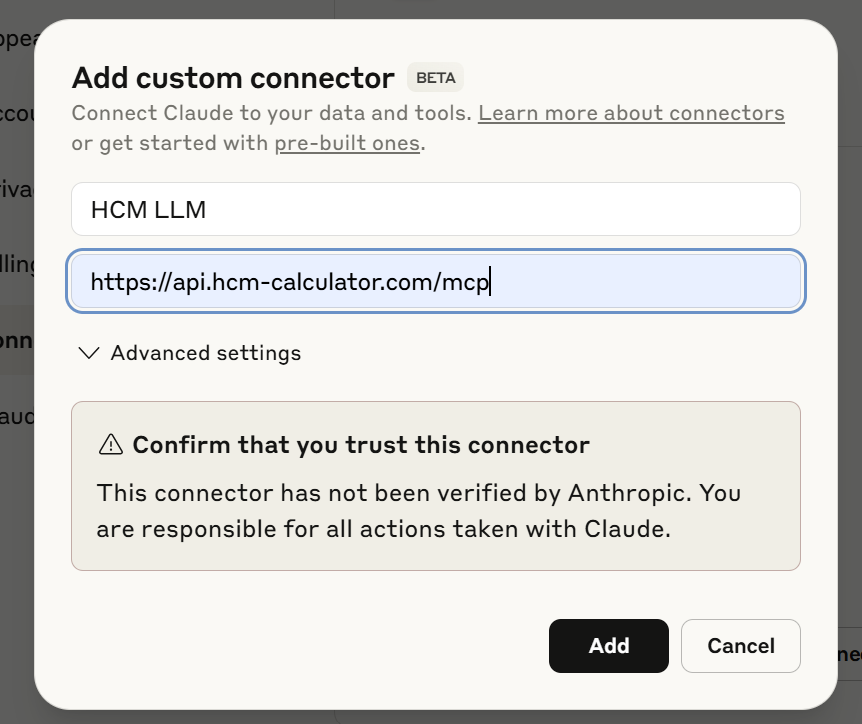

<h1 align="center">HCM-LLM MCP Server</h1>

A FastAPI-based Model Context Protocol (MCP) server for Highway Capacity Manual (HCM) analysis and transportation engineering calculations. So far, this server provides comprehensive two-lane highway analysis following HCM Chapter 15 methodology.

## Features

- Semantic search over HCM documentation
- Complete HCM Chapter 15 (two-lane highway) and Chapter 12 (basic freeway) analysis
- Full HCM chapter coverage, chapters 10 through 28, behind three capability tools (`hcm_analyze`, `hcm_describe`, `hcm_validate`) over 32 methods, each taking the library's own example-case JSON and each validated against its published example problem
- Input validation gateway against HCM/AASHTO constraints (via `transportations-validator`)
- Full-corpus validation (300+ rules across HCM/AASHTO/MUTCD/HSM/ADA/...) with citations, terrain/context-gated rules, and clarification requests — runs in-process, no database
- Knowledge-graph reasoning: abductive design repair (Two-Lane & Basic Freeway), defeasible code reconciliation, inverse design, and forward/backward chaining — every repair candidate re-executed through the verified library
- YAML-based function registry for easy extensibility
- Function calling interface with 15+ transportation analysis functions
- MCP server compatibility for integration with AI assistants (supporting Claude)
- RESTful API endpoints for direct access
- Dynamic endpoint generation based on registry
- Comprehensive test suite and validation tools

## Connect to Remote MCP Server
This server can be used as a backend for AI code agents like Claude Desktop, allowing them to perform complex transportation analyses and access HCM documentation dynamically.

To enable this functionality, add the server to your AI assistant's configuration as an MCP server.

### For Claude Desktop Users
From user setting, you can find `Connectors` tab and click `Add custom connector`.

Then add `https://api.hcm-calculator.com/mcp` to you Claude configuration.



### For GitHub Copilot on VSCode Users
You can also use this server with GitHub Copilot by configuring it as a custom MCP server.

To do this, type Ctrl+p and select `MCP: Open User Configuration` and modify the following to your `mcp.json`:

```json
{
	"servers": {
		"hcm-mcp": {
			"url": "https://api.hcm-calculator.com/mcp"
		}
	}
}
```

## Connect to Local MCP Server
You can also run this server locally for development or testing purposes.

```bash
uv venv

# Windows
.venv\Scripts\activate
# Linux
source .venv/bin/activate

uv pip install .
```

Then running the server.

```bash
# Setup the database.
python hcm_mcp_server/scripts/import_hcm_docs.py

# Start the server.
python mcp_server_fastapi.py
```

### For Claude Desktop Users
Open Claude Desktop and add the server as a custom MCP server with the URL `http://localhost:8000/mcp`.

Add to your Claude Desktop configuration (`claude_desktop_config.json`):

**Note**: Seems like this json settings are not working these days (https://github.com/anthropics/claude-code/issues/4188), and it did not work in my desktop environment, either.

```bash
{
  "mcpServers": {
    "hcm-mcp-local": {
      "url": "http://127.0.0.1:8000/mcp"
    }
  }
}
```

### For GitHub Copilot on VSCode Users
Same thing as above, you can use this server with GitHub Copilot by configuring it as a custom MCP server.

To do this, type Ctrl+p and select `MCP: Open User Configuration` and modify the following to your `mcp.json`:

```json
{
	"servers": {
		"hcm-mcp-local": {
			"url": "http://127.0.0.1:8000/mcp"
		}
	}
}
```

Then you can use the function calling interface directly in your code editor.


## Project Structure

```
hcm-mcp-server/
├── mcp_server_fastapi.py        # Main FastAPI application
├── functions_registry.yaml      # Function registry configuration
├── hcm_mcp_server/
│   ├── example_prompts/                  
│   │   ├── *.txt                # Example prompts for function calling
│   │   └── *.json               # Example json files for web validation
│   ├── core/                    # Core application modules
│   │   ├── dependencies.py      # Dependency injection and utilities
│   │   ├── registry.py          # Function registry implementation
│   │   ├── models.py            # Pydantic data models
│   │   └── endpoints.py         # Dynamic endpoint creation
│   ├── functions/                  
│   │   ├── chapter15.py         # Chapter 15: Two-Lane Highways
│   │   └── research.py          # Research and documentation
│   └── scripts/                    
│       ├── import_hcm_docs.py   # Import HCM documentation and setup ChromaDB
│       └── validate_registry.py # Registry validation
├── data/                           
│   └──  hcm_files/               # HCM documentation files
└── chroma_db/                    # ChromaDB storage

```

## Configuration

### Environment Variables
Create a `.env` file based on `.env.example`. Copy and paste the following content, or `cp .env.example .env`:
```
CHROMA_DB_PATH=./chroma_db
HOST=127.0.0.1
PORT=8000
ALLOWED_ORIGINS=http://localhost:3000,http://localhost:3001
LOG_LEVEL=INFO
DB_MODE=local
PUBLIC_SUPABASE_URL=https://
PUBLIC_SUPABASE_API=your-anon-key / service-role-key
```

### Function Registry
Functions are defined in `functions_registry.yaml`:

```yaml
functions:
  chapter15:
    identify_vertical_class:
      module: "functions.chapter15"
      function: "identify_vertical_class_function"
      description: "Identify vertical alignment class range"
      category: "transportation"
      chapter: 15
      step: 1
      parameters:
        type: "object"
        properties:
          segment_index:
            type: "integer"
          highway_data:
            type: "object"
        required: ["segment_index", "highway_data"]
```

### Ablation arms (restricted MCP surfaces)

For the Table 5 / Figure 7 2x2 ablation, the same app can be launched exposing only a subset of tools, so a model can be evaluated under each condition in isolation:

```bash
python mcp_server_fastapi.py     # ct  : full system (all tools), port 8000
python mcp_server_kg_only.py     # kg  : 7 reasoning/validation tools only, port 8001 (no Chroma needed)
python mcp_server_rag_only.py    # rag : query_hcm only, port 8002
```

Both launchers are thin wrappers that set two env vars before importing the app:

- `HCM_MCP_INCLUDE_OPS` — comma-separated operation ids the MCP surface exposes (unset = all). Filtering uses `FastApiMCP(include_operations=...)`.
- `HCM_ENABLE_RAG` — set to `false` to skip loading the embedding model + vector store (the kg-only arm needs neither).

Point each VS Code / Claude Desktop MCP client at the port for the arm under test (e.g. `http://localhost:8001` for kg-only) so the model sees only that arm's tools. The `base` arm is simply no MCP server attached.

## API Usage

### Complete Highway Analysis

```bash
curl -X POST "http://localhost:8000/analysis/chapter15/complete" \
  -H "Content-Type: application/json" \
  -d '{
    "segments": [{
      "passing_type": 0,
      "length": 2.0,
      "grade": 2.0,
      "spl": 50.0,
      "volume": 760.0,
      "volume_op": 1500.0,
      "phf": 0.95,
      "phv": 5.0
    }],
    "lane_width": 12.0,
    "shoulder_width": 6.0,
    "apd": 5.0
  }'
```

### Function Calling Interface

```bash
curl -X POST "http://localhost:8000/tools/call" \
  -H "Content-Type: application/json" \
  -d '{
    "function": {
      "name": "chapter15_determine_free_flow_speed",
      "arguments": {
        "segment_index": 0,
        "highway_data": {
          "segments": [{"passing_type": 0, "length": 2.0, "grade": 2.0, "spl": 50.0}],
          "lane_width": 12.0,
          "shoulder_width": 6.0
        }
      }
    }
  }'
```

### List Available Functions

```bash
# List all functions
curl -X POST "http://localhost:8000/tools/list"

# Filter by category
curl -X POST "http://localhost:8000/tools/list" \
  -H "Content-Type: application/json" \
  -d '{"category": "transportation"}'

# Filter by chapter
curl -X POST "http://localhost:8000/tools/list" \
  -H "Content-Type: application/json" \
  -d '{"chapter": 15}'
```

### Query HCM Documentation

```bash
curl -X POST "http://localhost:8000/tools/query-hcm" \
  -H "Content-Type: application/json" \
  -d '{
    "question": "What factors affect free flow speed in two-lane highways?",
    "top_k": 5
  }'
```

## Available Functions

### Chapter 15 Functions
- `chapter15_identify_vertical_class` - Step 1: Identify vertical alignment class range
- `chapter15_determine_demand_flow` - Step 2: Calculate demand flow rates and capacity
- `chapter15_determine_vertical_alignment` - Step 3: Determine vertical alignment classification
- `chapter15_determine_free_flow_speed` - Step 4: Calculate free flow speed
- `chapter15_estimate_average_speed` - Step 5: Estimate average travel speed
- `chapter15_estimate_percent_followers` - Step 6: Estimate percentage of following vehicles
- `chapter15_determine_follower_density_pl` - Step 8a: Follower density for passing lanes
- `chapter15_determine_follower_density_pc_pz` - Step 8b: Follower density for PC/PZ segments
- `chapter15_determine_segment_los` - Step 9: Calculate segment Level of Service
- `chapter15_determine_facility_los` - Step 10: Calculate facility Level of Service
- `chapter15_complete_analysis` - Complete HCM Chapter 15 procedure

### Chapter 12 Functions (Basic Freeway Segments)
A different equation family than Chapter 15 — the `lane width -> FFS -> capacity/speed -> density -> LOS` chain. Requires `transportations-library>=0.1.12`.
- `chapter12_determine_free_flow_speed` - Step 2: Estimate and adjust free-flow speed
- `chapter12_estimate_capacity` - Step 3: Base and adjusted capacity (pc/h/ln)
- `chapter12_estimate_demand_volume` - Step 4: Per-lane flow rate v_p
- `chapter12_calculate_speed` - Step 5a: Space mean speed via the speed-flow curve
- `chapter12_estimate_density` - Step 5b: Density D = v_p / S
- `chapter12_determine_segment_los` - Step 6: Segment Level of Service
- `chapter12_complete_analysis` - Complete HCM Chapter 12 basic-freeway procedure

### HCM Analysis Capabilities (full chapter coverage)

Every HCM method the compute library implements, chapters 10 through 28, behind **three capability tools**. The method is an argument, not a tool: thirty-two near-identical schemas would cost every caller context and blunt tool selection, and the ten published tools above are already capability-shaped.

- `hcm_analyze` — `{method, config}`. Runs one method. The tool description carries the method catalog, one compact line each, and `method` is an enum of the thirty-two ids.
- `hcm_describe` — `{method?}`. With a method: its input schema sketch, its result-field meanings and the example-problem fixture that validates it. Without one: the catalog, every method id with its chapter and a one-line summary. Call this first; it is how a caller learns a method's shape without reading the Rust bindings.
- `hcm_validate` — `{method, config}`. Parses and checks a config **without running the analysis**, returning the library's own validation errors or ok. Iterating on a config costs a parse rather than a full analysis. Twenty-three of the thirty-two methods have a real validation step behind the constructor (serde deserialisation, constructor range checks, and for Chapter 15 the Exhibit 15-8 parameter ranges via `tl.validate_input`); the other nine are single JSON entry points in the library where parsing and computation are one call, and those say so in the response rather than running the analysis and calling it a validation.

The input is always the compute library's own example-case (fixture) JSON, passed as `config` — not a second flattened schema invented for the MCP layer. An example case from `transportations-library/tests/ExampleCases/hcm/` can be handed over unmodified. Requires `transportations-library>=0.3.6`.

| Chapter | `method` | What it computes |
| --- | --- | --- |
| 10 | `analyze_freeway_facility` | Freeway facility (Chapter 25 engine) |
| 10 | `analyze_managed_lanes` | Managed-lane freeway facility |
| 11 | `analyze_freeway_reliability` | Freeway travel-time reliability |
| 12 | `analyze_basic_freeway` | Basic freeway and multilane segment |
| 13 | `analyze_weaving` | Freeway weaving segment (HCM 7 and 7.1) |
| 14 | `analyze_merge_diverge` | Freeway merge and diverge segment (HCM 7 and 7.1) |
| 15 | `analyze_two_lane_highway` | Two-lane highway facility |
| 16 | `analyze_urban_facility` | Urban street facility |
| 17 | `analyze_urban_reliability` | Urban street travel-time reliability |
| 18 | `analyze_bicycle_segment` | Urban street segment, bicycle mode |
| 18 | `analyze_pedestrian_segment` | Urban street segment, pedestrian mode |
| 18 | `analyze_transit_segment` | Urban street segment, transit mode |
| 18 | `analyze_urban_segment` | Urban street segment, automobile mode |
| 19 | `analyze_signalized` | Signalized intersection, automobile mode |
| 19 | `analyze_signalized_bicycle` | Signalized intersection, bicycle mode |
| 19 | `analyze_signalized_pedestrian` | Signalized intersection, pedestrian mode |
| 19 | `analyze_two_stage_crossing` | Two-stage pedestrian crossing delay |
| 20 | `analyze_twsc` | Two-way STOP-controlled intersection, vehicular |
| 20 | `analyze_twsc_pedestrian` | TWSC and midblock crossing, pedestrian mode |
| 21 | `analyze_awsc` | All-way STOP-controlled intersection |
| 22 | `analyze_roundabout` | Roundabout |
| 23 | `analyze_alternative_intersection` | RCUT and MUT alternative intersections (Part C) |
| 23 | `analyze_displaced_left_turn` | Displaced left-turn intersection (Part C) |
| 23 | `analyze_ramp_terminal` | Interchange ramp terminals (Part B) |
| 24 | `analyze_offstreet_bicycle` | Off-street path, bicycle mode |
| 24 | `analyze_pedestrian_walkway` | Exclusive pedestrian walkway or stairwell |
| 24 | `analyze_shared_use_path_pedestrian` | Shared-use path, pedestrian mode |
| 25 | `analyze_composite_grade` | Mixed-flow model, composite grade |
| 25 | `analyze_planning_facility` | Planning-level freeway facility |
| 26 | `analyze_mixed_flow` | Mixed-flow model, single grade |
| 27 | `analyze_weaving_service_volumes` | Weaving segment service volumes |
| 28 | `analyze_ramp_service_volumes` | Merge and diverge service volumes |

Each method ships its worked example under `hcm_mcp_server/data/examples/<method>.json`, and `tests/test_methods.py` drives every one of them through `hcm_analyze` against the published values of that example problem, at the tolerances the compute library's own test suite asserts.

Each method also keeps a method-shaped REST route at `/analysis/hcm/<method-with-hyphens>` for direct API callers. Routes are not MCP tools, so these cost a caller's context nothing.

Domain refusals carry the library's own message. An un-digitised mixed-flow grade, an off-domain specific-upgrade PCE and a malformed config all come back as `{"success": false, "error": "..."}` in the library's words, because those messages say what the published HCM data covers.

**These tools are not in the default MCP surface.** `mcp_server_fastapi.py` is the `ct` ablation arm, and the ten tools it advertises by default are the surface the published experiment ran against (see `tests/test_frozen_surface.py`). Set `HCM_MCP_FULL_COVERAGE=true` to append the three capability tools to the MCP mount. Without it they are still reachable over REST and through `/tools/call`.

### Validation Functions
- `validation_validate_design_full` - Validate a design against the **full rule corpus** (300+ rules: HCM, AASHTO, MUTCD, HSM, ADA, OpenDRIVE, ...) with citations, terrain/jurisdiction-gated rules, and clarification requests when an input is missing or its context is ambiguous. Runs in-process over the bundled seed corpus — no database. (The Chapter 15/12 tools use a lighter semantic-firewall gateway; this is the complete engine.) Requires `transportations-validator>=0.2.0` + `sqlalchemy`.

### Research Functions
- `query_hcm` - Query HCM documentation database

### Reasoning Functions
The X-KG reasoning layer reasons over the knowledge graph and the verified executable substrate. Repair and inverse-design **re-execute every candidate through `transportations-library`** before returning it, so results are proved compliant rather than asserted. No database is required.
- `reasoning_propagate_change` - Forward-chain: downstream parameters affected by a changed input
- `reasoning_diagnose_failure` - Backward-chain: upstream causes of a failing parameter
- `reasoning_repair_design` - Abductive repair: minimal compliant fix for a Two-Lane Highway (HCM Ch.15)
- `reasoning_repair_freeway` - Abductive repair: minimal compliant fix for a Basic Freeway (HCM Ch.12)
- `reasoning_reconcile_codes` - Defeasible adjudication of conflicting code provisions, with an argument trace
- `reasoning_inverse_design` - Goal-directed synthesis: feasible geometries reaching a target LOS

> **Dependencies:** the reasoning functions require `transportations-validator>=0.2.0` and `transportations-library>=0.1.12` (the latter for the BasicFreeways binding used by `reasoning_repair_freeway`). Both are on PyPI, so a normal `pip install` (or `uv sync`) resolves them.


## API Endpoints
Hit the API endpoints directory to perform analyses or query HCM documentation.

**Note**: /docs for detail api endpoints description is under construction and will be available soon.

### Core Endpoints
- `POST /tools/call` - Execute any registered function
- `POST /tools/list` - List available functions with filtering
- `GET /mcp/discovery` - MCP capability discovery

### Per-method HCM analysis

```
POST /analysis/hcm/analyze                # {method, config}
POST /analysis/hcm/describe               # {method?} - catalog, or one method's schema + worked example
POST /analysis/hcm/validate               # {method, config} - parse and check, without running

POST /analysis/hcm/<method-with-hyphens>  # method-shaped convenience route, e.g. /analysis/hcm/analyze-roundabout
```

The per-method routes take `{"config": { ... }}` in that method's example-case schema. See **HCM Analysis Capabilities** above for the full list.

### Chapter 15 Analysis
- `POST /analysis/chapter15/complete` - Complete HCM analysis
- `POST /analysis/chapter15/segment` - Single segment analysis

### Research
- `POST /tools/query-hcm` - Query HCM database
- `POST /research/search_hcm_by_chapter` - Search HCM content by specific chapter
- `GET /research/get_hcm_section` - Get specific HCM section content
- `POST /research/summarize_hcm_content` - Summarize HCM content for a topic

### Reasoning & Validation
Dedicated endpoints (and therefore first-class MCP tools) for the X-KG reasoning layer and full-corpus validation. Each resolves its implementation from the registry, so the surface stays in sync with `function_registry.yaml`.
- `POST /reason/propagate-change` - Forward-chain downstream impacts
- `POST /reason/diagnose-failure` - Backward-chain upstream causes
- `POST /reason/repair-design` - Minimal compliant fix (Two-Lane Highway, HCM Ch.15)
- `POST /reason/repair-freeway` - Minimal compliant fix (Basic Freeway, HCM Ch.12)
- `POST /reason/reconcile-codes` - Defeasible multi-jurisdiction adjudication
- `POST /reason/inverse-design` - Goal-directed geometry synthesis
- `POST /validate/design-full` - Validate against the full rule corpus with citations + clarifications

### Utility
- `GET /health` - Health check
- `GET /registry/info` - Registry information
- `POST /registry/reload` - Reload function registry

## Data Models

### Highway Segment
```python
{
  "passing_type": 0,      # 0=PC, 1=PZ, 2=PL
  "length": 2.0,          # miles
  "grade": 2.0,           # percent
  "spl": 50.0,            # speed limit (mph)
  "volume": 760.0,        # vehicles/hour
  "volume_op": 1500.0,    # opposing volume
  "phf": 0.95,            # peak hour factor
  "phv": 5.0              # percent heavy vehicles
}
```

### Highway Facility
```python
{
  "segments": [...],      # list of segments
  "lane_width": 12.0,     # feet
  "shoulder_width": 6.0,  # feet
  "apd": 5.0,             # access points/mile
  "pmhvfl": 0.02,         # percent HV in fast lane
  "l_de": 0.0             # effective passing distance
}
```

## Adding New HCM Chapters

### 1. Create Function Module
Create `functions/chapter16.py`:

```python
def new_analysis_function(data: Dict[str, Any]) -> Dict[str, Any]:
    """Implementation for new analysis."""
    try:
        # Your implementation here
        return {"success": True, "result": "analysis_result"}
    except Exception as e:
        return {"success": False, "error": str(e)}
```

### 2. Update Registry
Add to `functions_registry.yaml`:

```yaml
functions:
  chapter16:
    new_analysis:
      module: "functions.chapter16"
      function: "new_analysis_function"
      description: "New analysis function"
      category: "transportation"
      chapter: 16
      parameters:
        type: "object"
        properties:
          input_param:
            type: "string"
        required: ["input_param"]
```

### 3. Restart Server
The registry will automatically load the new functions.


## Development

### Running Tests
**Note**: Test will be added soon.
```bash
pytest tests/
```

### Validating Registry
**Note**: Not used yet.
```bash
python scripts/validate_registry.py
```

### Setting Up Development Database
```bash
python scripts/import_hcm_docs.py
```

## Customization

### Custom Analysis Models
Extend models in `core/models.py`:

```python
class CustomAnalysisInput(BaseModel):
    parameter1: float = Field(description="Custom parameter")
    parameter2: str = Field(description="Another parameter")
```

### Custom Functions
1. Implement function in appropriate module
2. Add to `functions_registry.yaml`
3. Restart server or call `/registry/reload`

## Support

This project is beta version and mainly for research purpose for now. It is widely appreciated for any contributions or feedback!

For issues and questions:
- Open an issue on GitHub
- Check the API documentation at `/docs`
- Review function registry at `/registry/info`
- Validate setup with utility scripts
